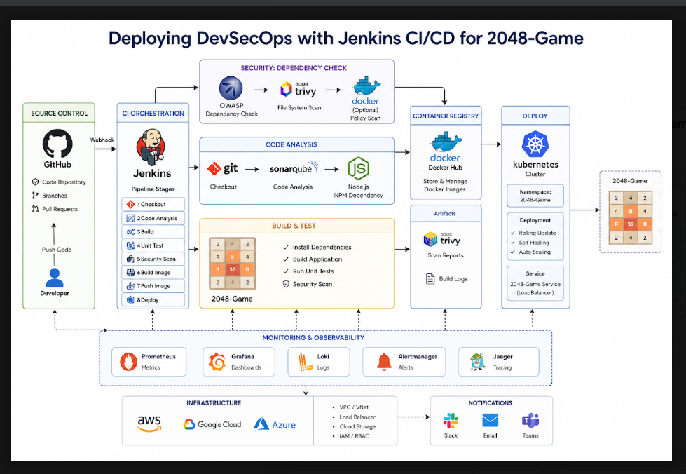
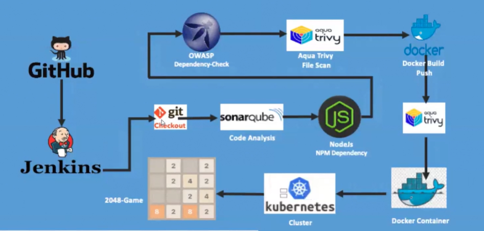
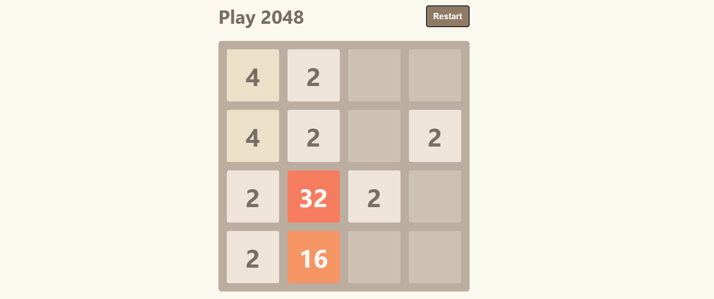
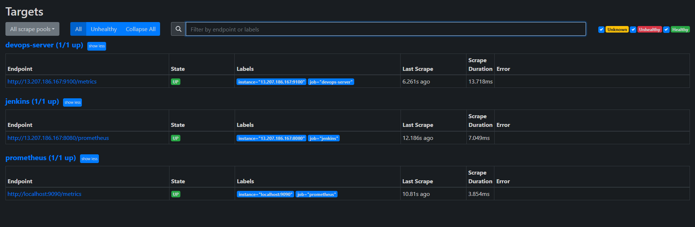
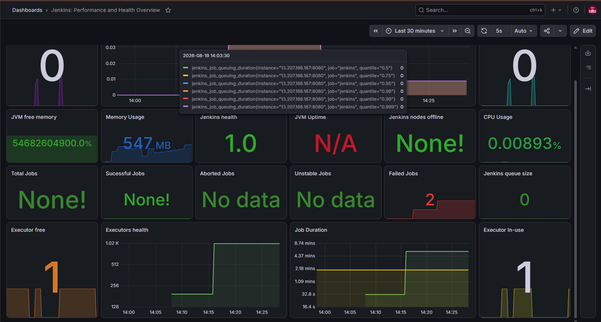
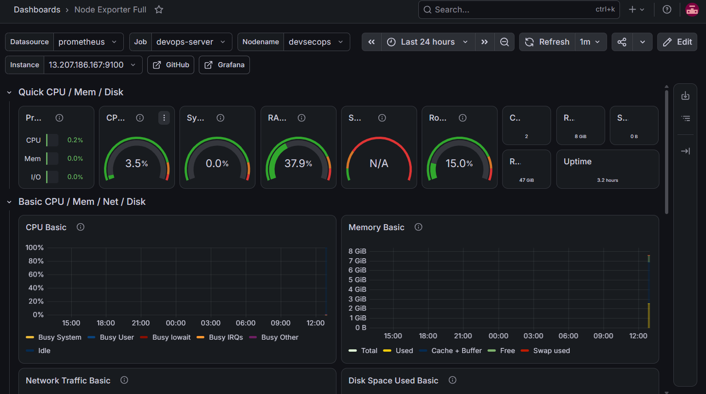
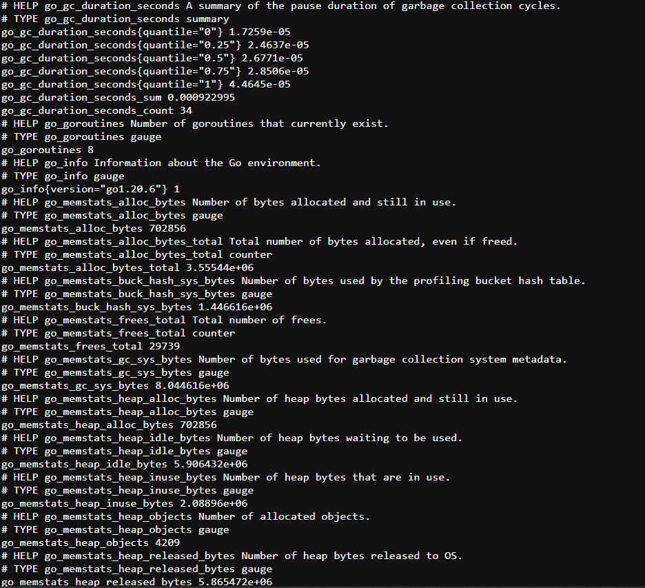

🚀 DevSecOps CI/CD Pipeline for 2048 Game on AWS EKS
Project Overview

This project is a containerized 2048 game application deployed on AWS EKS through a fully automated DevSecOps CI/CD pipeline. The pipeline provisions infrastructure with Terraform, runs code quality and security scans on every build, and deploys the application to Kubernetes — with Prometheus and Grafana providing full observability into the cluster and pipeline.

⚙️ Pipeline Workflow

Developer Push → GitHub → Jenkins Pipeline → SonarQube (Code Analysis) → Trivy (Filesystem Scan) → Docker Build & Push → Trivy (Image Scan) → Deploy to Kubernetes (EKS) → Prometheus & Grafana Monitoring

🏗️ Architecture

🔄 CI/CD Workflow

🌐 Application

📊 Monitoring & Observability
Prometheus Targets

Grafana — Jenkins Metrics

Grafana — Server / Node Metrics

Node Exporter

🛠️ Tools & Technologies Used
Jenkins
Terraform
Docker
Kubernetes (AWS EKS)
SonarQube
Trivy
Prometheus
Grafana
Node Exporter
AWS EC2, IAM
GitHub

📦 Pipeline Stages
Source Control
Code hosted on GitHub
Webhook triggers Jenkins pipeline on push
Infrastructure Provisioning
AWS EKS cluster provisioned using Terraform
Automated terraform init, plan, and apply/destroy via a parameterized Jenkins job
Code Quality & Security
Static code analysis performed using SonarQube with a configured quality gate
Filesystem vulnerability scan performed using Trivy before build
Docker image vulnerability scan performed using Trivy after build
Build & Deployment
Application containerized using Docker
Image pushed to Docker Hub
Deployed to Kubernetes via kubectl apply with rolling updates
Monitoring
Prometheus scrapes metrics from the application server and Jenkins
Grafana dashboards visualize cluster health, node metrics, and pipeline performance

🎯 Outcome
Provisioned AWS infrastructure as code using Terraform
Built an automated Jenkins CI/CD pipeline with integrated security scanning
Implemented code quality gates using SonarQube
Implemented vulnerability scanning using Trivy at both filesystem and image level
Containerized and deployed the application to Kubernetes on AWS EKS
Set up Prometheus and Grafana for cluster and pipeline observability
Gained hands-on experience with DevSecOps practices on AWS

📚 Key Learnings
Infrastructure as Code with Terraform
Jenkins pipeline orchestration
Static code analysis and quality gates with SonarQube
Vulnerability scanning with Trivy
Docker containerization
Kubernetes deployments and services on AWS EKS
Monitoring and observability with Prometheus and Grafana
End-to-end DevSecOps pipeline design
👨‍💻 Author

Sanjeevan Varma GitHub: https://github.com/sanjeevanvarma LinkedIn: https://www.linkedin.com/in/sanjeevan-varma-indukuri-90943529b/
